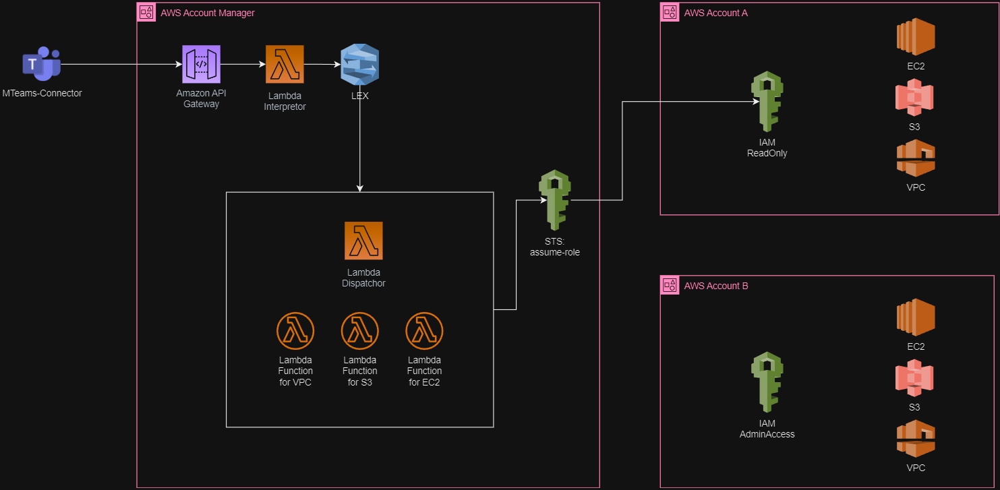
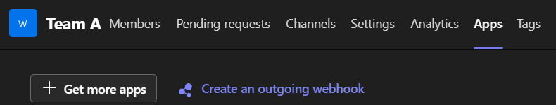
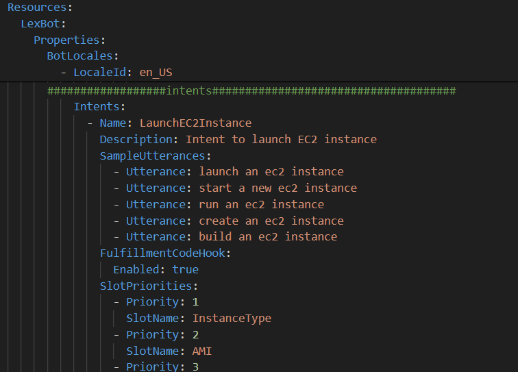
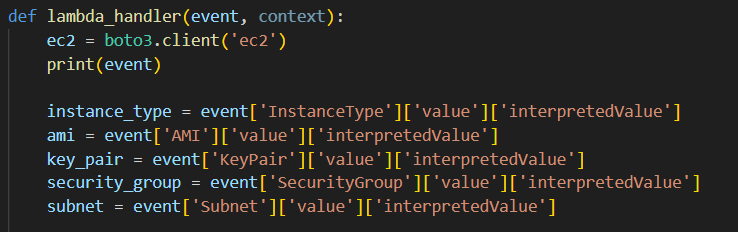
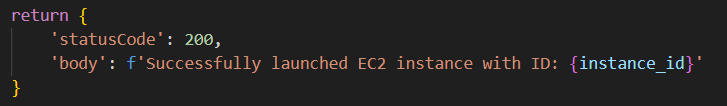
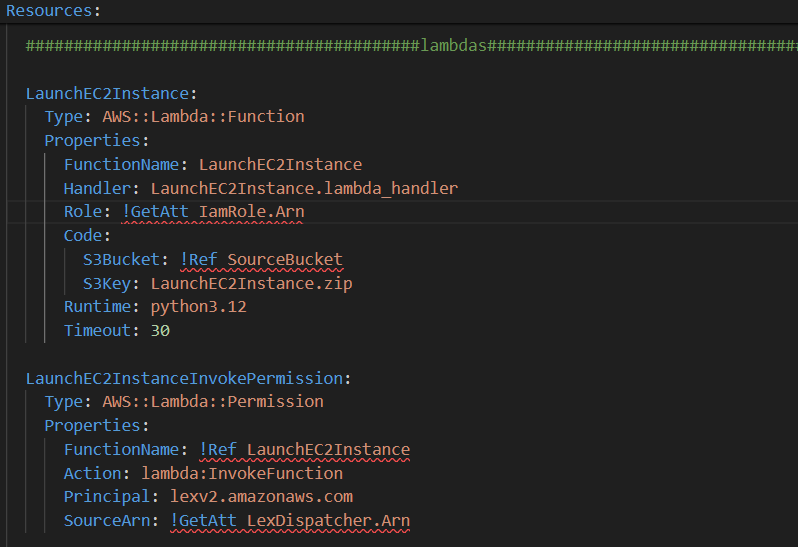

# README - Projet de Développement d'un Chatbot IA avec l'Infrastructure AWS

Ce projet implémente un chatbot sur l'infrastructure AWS pour aider les utilisateurs à récupérer des informations et à exécuter des actions sur leurs propres services AWS via la plateforme Teams. Il utilise AWS CloudFormation pour déployer un bot Lex V2 intégré avec Lambda et API Gateway.

## Contenu du Projet

### Fichiers du Projet
- `Lex-Full-CloudformationTemplate.yml` : Template CloudFormation pour déployer l'infrastructure AWS.
- `ListS3buckets.py` : Fonction Lambda pour lister les buckets S3.
- `TeamsToLex.py` : Fonction Lambda pour l'intégration avec API Gateway.
- `LexDispatcher.py` : Fonction Lambda pour le routage des requêtes Lex vers leurs fonctions Lambda correspondantes.
- `LaunchEC2Instance.py` : Fonction Lambda pour démarrer une instance EC2.
- `IAM-Account-AdminAccess-CloudformationTemplate.yml` : Accorde des permissions d'administrateur et autorise le compte externe à assumer ce rôle.
- `IAM-Account-ReadOnly-CloudformationTemplate.yml` : Accorde des permissions en lecture seule et autorise le compte externe à assumer ce rôle.

### Structure du Projet
- **CloudFormation** : Définition des ressources IAM, Lex Bot, Lambda Functions, API Gateway.
- **Lambda Functions** : Fonctions pour le traitement des requêtes Lex et l'intégration avec d'autres services AWS.
- **Lex Bot** : Configuration des intents, slots et messages de prompt pour l'interaction utilisateur.
- **IAM Roles** : Gestion des permissions.



## Output

### Interaction avec le Bot Lex
Utilisez l'URL POST générée par API Gateway pour interroger le bot via des requêtes POST.

## Comment ça marche

1. **Préparation des fichiers** :
   - Dans le dossier `tools`, vous trouverez des scripts pour uploader les fichiers nécessaires dans votre compte AWS pour pouvoir les utiliser avec CloudFormation.
   - Exécutez le script correspondant à votre machine. Exemple pour Windows :
     ```sh
     cd tools
     ./zip_upload_windows.ps1
     ```
   - Le retour de ce script est l'URL S3 du template CloudFormation.

2. **Déploiement avec CloudFormation** :
   - Dans la console CloudFormation, créez un nouveau stack avec l'URL S3 obtenue précédemment.
   - Donnez un nom au stack, spécifiez le nom du bucket S3 (si vous l'avez changé dans les fichiers script) et un nom pour le stage de l'API (dev, test, prod, etc.).
   - Créez le stack.

3. **Récupération de l'URL POST** :
   - Après la création du stack, dans la console CloudFormation, naviguez vers l'onglet Outputs pour récupérer l'URL POST de l'API Gateway.

4. **Intégration avec MS Teams** :
   - Utilisez l'option "Manage team" de MS Teams pour configurer un Outgoing Webhook.
   - Sélectionnez Outgoing Webhook dans l'onglet App des paramètres de la team.

   

   - Ajoutez un nom, l'URL POST et une image pour le bot.

**Note** : En raison des limitations de la fonctionnalité Outgoing Webhook de MS Teams, chaque interaction avec le bot nécessite de le mentionner. En plus le Outgoing Webhook a un timeout de 30 seconds (y inclue le traitement de MS Teams, API Gateway et les Lambdas).

## Ajouter une Fonctionnalité au Bot

Pour ajouter une fonctionnalité au bot :

1. **Ajouter un intent** :
   - Modifiez le fichier `Lex-Full-CloudformationTemplate.yml` pour ajouter un nouvel intent.
   - Ajoutez des types de slots supplémentaires si nécessaire.

   

2. **Créer la fonction Lambda** :
   - Créez un fichier Python dans le dossier `lambdas/librairies` qui répondra à cet intent.
   - La fonction Lambda recevra un objet JSON contenant les slots, <br/>
    effectuera le traitement nécessaire et retournera un JSON avec un status et un body String contenant le message à retourner par l'intent.

   
   
   

3. **Déploiement de la Lambda** :
   - Ajoutez le code de déploiement de la Lambda dans le fichier `Lex-Full-CloudformationTemplate.yml` avec les permissions nécessaires.

   

**Note** : Les noms des fichiers Lambda doivent être les mêmes que ceux des fonctions Lambda et des intents pour faciliter l'intégration, sauf en cas de modification manuelle.

## Utilisation du Bot avec d'Autres Comptes

Pour utiliser le bot avec d'autres comptes AWS :

1. **Accorder les Permissions** :
   - Utilisez les fichiers CloudFormation `IAM-Account-AdminAccess-CloudformationTemplate.yml` et `IAM-Account-ReadOnly-CloudformationTemplate.yml` pour accorder les permissions nécessaires depuis les comptes externes.

2. **Ajouter les Comptes Manuellement** :
   - Ajoutez les comptes manuellement dans le LexDispatcher et dans le fichier yml.